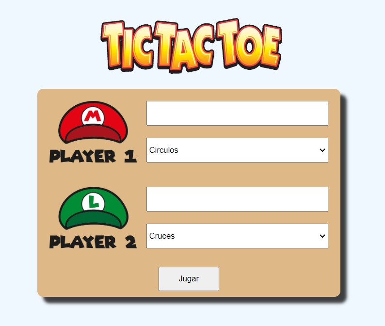
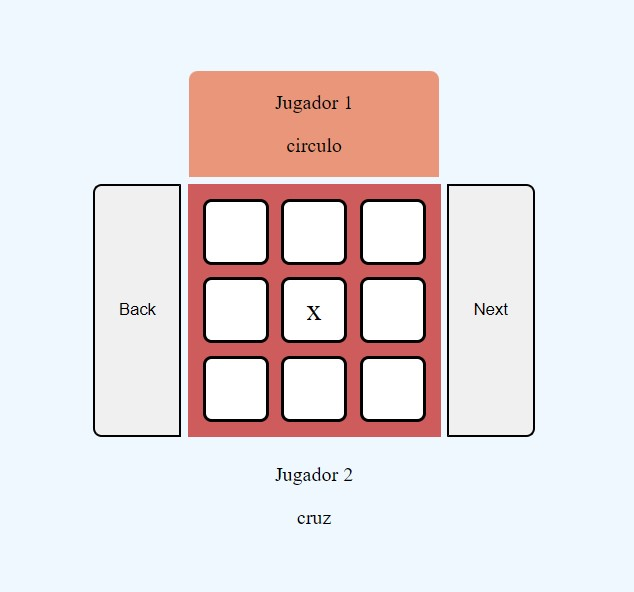
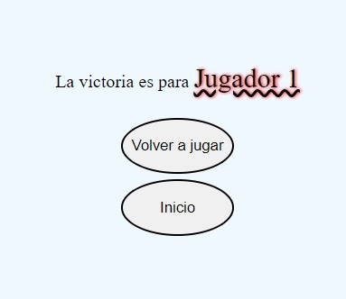

# proyecto 3-Tic Tac Toe
Proyecto 3 del bootcamp. Consiste en desarrollar un **Tic Tac Toe** simple y plenamente funcional, usando JavaScript  

En la **pantalla de entrada** elegimos los jugadores y la ficha de cada jugador

Algunas características a destacar de la pantalla inicial son:
- Comprobacion de que los nombres no tengan mas de 10 caracteres
- Al cambiar la ficha de un jugador cambia la del otro automaticamente

Una vez aceptados los nombres pasamos a la **ventana de juego**, donde se desarrolla la partida

Algunas características a destacar de la pagina de juego son:
- Posibilidad de rectificar tu jugada con el botón back o de verificar tu jugada con el boton next
- El juego sigue la lógica de solo utilizar 3 fichas, y a partir de la tercera hay que mover una ficha ya colocada, para ponerla en otro sitio. Esta lógica no es la original del tic-tac-toe clasico, pero me gusta más así, y además es como yo lo aprendí.
- Posibilidad de arrastrar la ficha con el ratón: en vez de realizar dos toques para mover la ficha, también puedes arrastrarla con el raton desde su posicion inicial a la posicion objetivo
- Diseño minimalista y responsive

Finalmente si uno de los jugadores gana, saltará automaticamente a la **pagina de victoria**, donde se proclama al vencedor de la partida y nos deja brevemente volver a jugar otra partida o volver a la pantalla de título.
